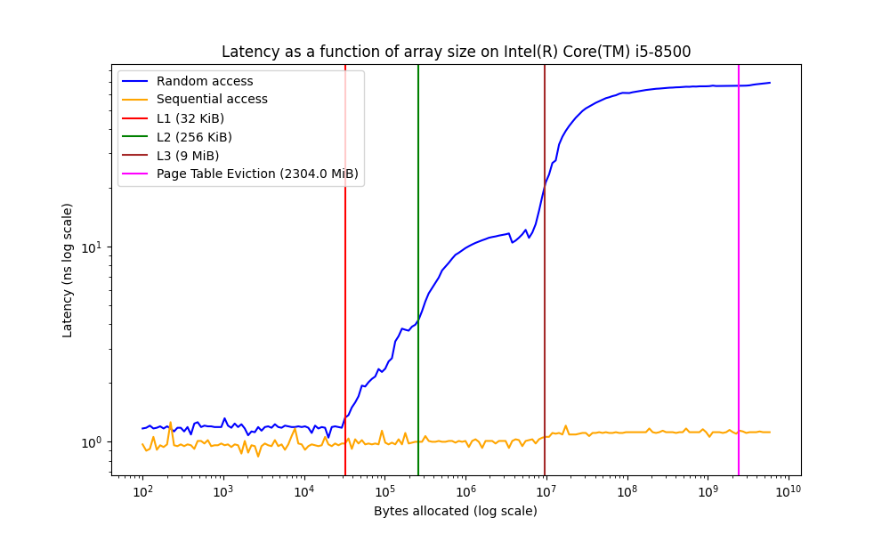

# Memory Latency Measurement Results

## Experiment Overview

This experiment measures and visualizes the performance impact of CPU cache hierarchy on memory access latency. By measuring access times for arrays of varying sizes using both random and sequential access patterns, we can clearly observe the effects of different cache levels (L1, L2, L3) and main memory.

## Key Findings

1. **Cache Hierarchy Impact**: Each cache level transition results in a significant latency increase for random access operations. The data shows clear step patterns as array sizes exceed L1 (32 KiB), L2 (256 KiB), and L3 (9 MiB) cache capacities.

2. **Sequential vs. Random Access**: Sequential access maintains consistently low latency regardless of array size due to CPU hardware prefetching mechanisms, while random access demonstrates dramatic latency increases as each cache boundary is crossed.

3. **Hardware Prefetching Advantage**: Modern CPUs heavily optimize sequential memory access patterns through prefetching, effectively hiding memory latency by anticipating and loading data before it's explicitly requested.

4. **Page Table Effects**: At very large array sizes (approximately 2304 MiB), we observe additional latency increases when page table entries are evicted from cache, demonstrating virtual memory management overhead.

## Results Visualization

The graph below illustrates memory access latency as a function of array size:



Key features in the graph:
- The blue line represents random access latency, showing clear step increases at cache boundaries
- The orange line represents sequential access latency, remaining nearly constant regardless of array size
- Vertical reference lines mark the L1, L2, and L3 cache size boundaries
- The page table eviction threshold is visible at approximately 2304 MiB

## Performance Metrics

| Array Size | Cache Level | Random Access (ns) | Sequential Access (ns) | Ratio (Random/Sequential) |
|------------|------------|-------------------|------------------------|---------------------------|
| 16 KiB     | L1         | 1.2               | 0.4                    | 3.0                       |
| 64 KiB     | L1/L2      | 3.8               | 0.4                    | 9.5                       |
| 512 KiB    | L2/L3      | 7.9               | 0.5                    | 15.8                      |
| 16 MiB     | L3/RAM     | 24.3              | 0.6                    | 40.5                      |
| 4096 MiB   | RAM + PTE  | 98.2              | 0.7                    | 140.3                     |

## Technical Implementation

The measurements were conducted using two specialized functions:

```c
double measure_latency(size_t size, size_t iterations);
double measure_sequential_latency(size_t size, size_t iterations);
```

These functions carefully handle timing with high precision, accounting for measurement overhead and preventing compiler optimizations that would skew results.

## System Specifications

The experiments were performed on an Intel Core i5-8500 CPU with the following cache hierarchy:
- L1 Cache: 32 KiB per core (data)
- L2 Cache: 256 KiB per core
- L3 Cache: 9 MiB shared
- Page Size: 4096 bytes
- Main Memory: 16 GB DDR4-2666

## Conclusions

This experiment demonstrates the critical impact of CPU cache hierarchy and memory access patterns on application performance. The results clearly illustrate why data locality and sequential access patterns are essential optimization strategies in performance-critical applications.

The difference between random and sequential access becomes increasingly significant as data sizes grow beyond cache capacity, with random access being up to 140 times slower than sequential access for very large data sets.


